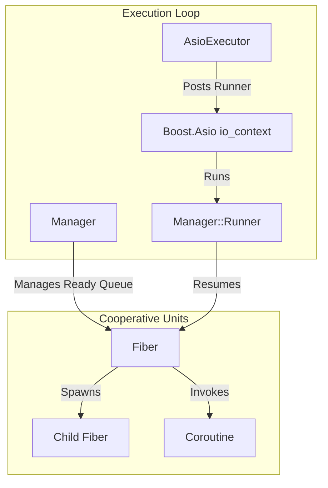
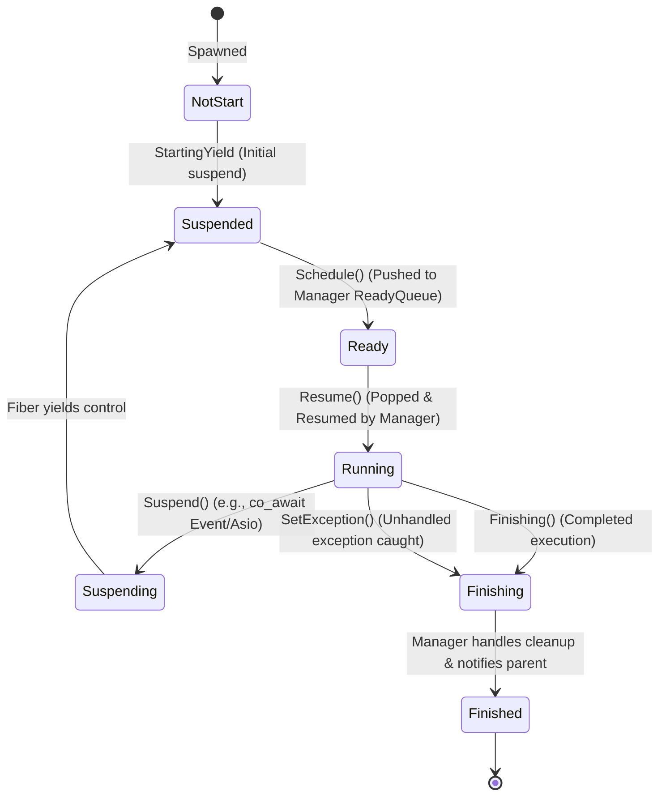
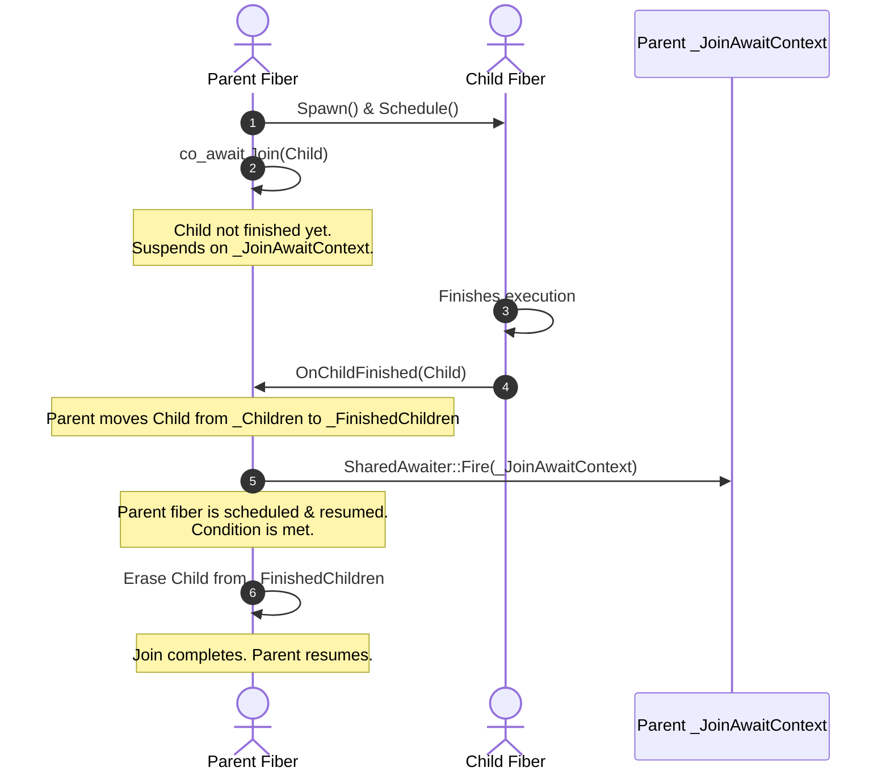

# OmniFiber: Architecture and Design Specifications

This document outlines the internal design, architecture, and implementation details of **OmniFiber**, a C++23 cooperative fiber library integrated with **Boost.Asio**.

---

## 1. Architectural Overview

OmniFiber addresses a key limitation of C++ standard coroutines: **they are stackless language-level constructs and do not include a runtime scheduler**. To turn standard coroutines into full-featured, structured cooperative fibers, OmniFiber implements:

1. **A Custom Promise/Awaiter Lifecycle (`Coroutine<T>`)**: Handles state, return values, exceptions, and resumes calling frames via symmetric transfer.
2. **A Fiber Representation (`Fiber`)**: Implements cooperative fibers with parent-child tracking and robust exception safety.
3. **An Execution Scheduler (`Manager` & `Executor`)**: Enqueues and dispatches "ready" fibers in a cooperative-multitasking style.
4. **Boost.Asio Integration (`AsioExecutor` & `AsioUseFiber`)**: Adapts asynchronous callbacks into cooperatively suspending await points using a custom completion token.
5. **Modern C++23 Features**: Utilizes C++23 explicit object parameters (`this Impl& self`) and standard `std::expected` for monadic error handling.



---

## 2. The Custom C++23 Coroutine State Machine (`Coroutine<T>`)

Standard C++ coroutines require a return type acting as the "coroutine interface" along with a nested `promise_type`. OmniFiber defines `Coroutine<RetType>`, where:

- `PromiseBase`, `PromiseVoid`, and `PromiseNonVoid` act as promise objects representing the coroutine's internal control block:
  - `initial_suspend()` returns `std::suspend_always{}`, ensuring lazy initialization of the coroutine.
  - `final_suspend()` returns an anonymous struct `FinalAwaiter` whose `await_suspend()` performs symmetric transfer to resume the continuation handle of the caller (`_Caller`), propagating control back up the call stack.
  - `unhandled_exception()` catches exceptions escaping from the coroutine body, stores them in the internal `std::expected` state, and dumps debug stack traces in non-production builds (`#ifndef NDEBUG`).
- The lifecycle of the underlying coroutine state is bound to the `Coroutine` object. The destructor of `Coroutine` destroys the handle (`_Callee.destroy()`) and asserts that the coroutine is fully finished (`assert(_Callee.promise().IsFinished())`), preventing resource leaks and unfinished execution chains.

### Dynamic Stack-Based Fiber Retrieval (`GetCurrentOmniFiber`)

To retrieve the active `Fiber` reference from nested coroutine frames without using any global or thread-local variables, OmniFiber implements a dynamic stack-based traversal:

1. **`FiberPromise` Interface**: Defines the virtual method `virtual Fiber& GetFiber() = 0;`.
2. **Root Promise**: `Fiber::FiberFrame::Promise` (the root frame of any Fiber) overrides `GetFiber()` to directly return the reference to the owning `Fiber`.
3. **Coroutine Promise Delegation**: The intermediate `Coroutine` promise `PromiseBase` overrides `GetFiber()` to recursively delegate up the chain using `_CallerPromise.value().get().GetFiber()`.
4. **Symmetric Traversal Awaiter (`GetCurrentOmniFiber`)**:
   When `co_await GetCurrentOmniFiber()` is invoked, the compiler passes `std::coroutine_handle<PromiseType> caller` to the awaiter's `await_suspend()`. The awaiter extracts `caller.promise().GetFiber()`, caches it in a private pointer, and returns `false` to prevent suspension. `await_resume()` then returns the cached `Fiber&` without yielding.

---

## 3. Fiber Lifecycle and State Machine

A `Fiber` is a scheduled unit of execution wrapped around an outer root `Coroutine<void>`. It transitions through several distinct states during its lifetime:



### State Definitions & Transition Mechanics

1. **`NotStart`**: The initial state when a `Fiber` is constructed. Inside the constructor, a wrapper helper `SpawnFiber` is invoked, which immediately triggers the coroutine's `initial_suspend()`.
2. **`Suspended`**: The fiber is yielding. Upon `initial_suspend()`, the fiber executes `StartingYield()`, capturing the initial coroutine handle, shifting to `Suspended`, and returning flow to the creator.
3. **`Ready`**: The fiber is placed in the `Manager`'s ready queue. The transition from `Suspended` to `Ready` occurs when `Schedule()` is called.
4. **`Running`**: The scheduler is actively executing the fiber. The `Manager` calls `fiber->Resume()`, which resumes the continuation handle.
5. **`Suspending`**: The fiber has hit a cooperative suspension point. It invokes `Suspend()`, stores the caller continuation handle, and changes its state to `Suspending` before yielding back to the `Manager`'s loop.
6. **`Finishing`**: The fiber has finished its outer function or encountered an unhandled exception. It triggers `final_suspend()`, calling `Finishing()` or `SetException()`.
7. **`Finished`**: The fiber has completely unwound. The `Manager` marks it as `Finished` and notifies its finish notifier.

---

## 4. Structured Parent-Child Concurrency and Joining

OmniFiber implements structured parent-child relationships between fibers to prevent orphaned tasks, leaking resources, and uncaught exceptions:

- **Spawning**: Calling `Spawn` on a parent constructs a child `Fiber`. The parent stores a `std::shared_ptr` to the child inside its `_Children` set.
- **Finishing & Signaling**: When a child fiber terminates, its `ChildFiberFinishNotifier` calls the parent's `OnChildFinished` method. The parent moves the child from `_Children` to `_FinishedChildren` and fires a shared await context:
  ```cpp
  _FinishedChildren.insert(*it);
  _Children.erase(it);
  SharedAwaiter::Fire(_JoinAwaitContext);
  ```
- **The Cooperative Wait Primitives**:
  - `Wait(until_callback)`: Cooperatively yields the active fiber using `co_await AwaiterAlwaysSuspend<SharedAwaiter>(_JoinAwaitContext)` in a loop until the boolean condition `until_callback()` is satisfied.
  - `Join(child)`: Waits until `_FinishedChildren` contains the targeted child fiber, erases it, and checks for exceptions. If the child failed, it propagates the error by throwing a `FiberException` wrapping the original exception.
  - `WaitFor()`: Cooperatively yields until `_FinishedChildren` is not empty, pops the first completed child, checks for exceptions, and returns the `std::shared_ptr<Fiber>` child pointer.
  - `WaitAll()`: Loops `WaitFor()` until both `_Children` and `_FinishedChildren` are completely empty.



> [!IMPORTANT]
> **Enforced Structured Concurrency**:
> Before a fiber completes, `Finishing()` asserts `assert(_Children.empty() && _FinishedChildren.empty());`. This enforces that parents **must** join or wait for all spawned children before they exit, preventing dangling fibers.

---

## 5. Boost.Asio Integration and `AsioUseFiber`

The flagship feature of OmniFiber is its integration with **Boost.Asio**, enabling standard asynchronous I/O operations to be co_awaited directly inside fibers.

### The `AsioExecutor`
A lightweight bridge that connects the `Manager` to the Boost.Asio event loop:
- `AsioExecutor` implements the virtual `Executor::Post(Manager&)` method.
- When `Post` is called, it posts the `Manager::Runner` functor to the `boost::asio::io_context` using `boost::asio::post`.

### Custom Completion Token (`AsioUseFiber`)
Boost.Asio's extensible architecture uses **Completion Tokens** to customize the return type of asynchronous operations. OmniFiber hooks into this mechanism by specializing the `boost::asio::async_result` struct for the `AsioUseFiberType` token:

```cpp
template <typename... Results> struct async_result<Omni::Fiber::AsioUseFiberType, void(Results...)> {
  template <typename Initiation, typename... InitArgs>
  static Omni::Fiber::Coroutine<std::tuple<Results...>> initiate(Initiation&& init, Omni::Fiber::AsioUseFiberType,
                                                                 InitArgs&&... initArgs) {
    auto helper = [](std::decay_t<Initiation> initiation,
                     std::decay_t<InitArgs>... initArgs) -> Omni::Fiber::Coroutine<std::tuple<Results...>> {
      // 1. Create a cooperatively awaitable event
      Omni::Fiber::Event<std::tuple<Results...>> event;
      
      // 2. Initiate the standard Asio operation, binding a callback that fires the event
      initiation([&event](Results... results) { event.Fire(std::make_tuple(std::move(results)...)); },
                 std::move(initArgs)...);
                 
      // 3. Cooperatively co_await the event inside the fiber
      co_return co_await event;
    };
    return helper(std::forward<Initiation>(init), std::forward<InitArgs>(initArgs)...);
  }
};
```

---

## 6. Synchronization & Multiplexing Primitives

OmniFiber provides cooperative synchronization tools to coordinate independent fibers without blocking system threads. All awaitables delegate wait queue management to the centralized  `SharedAwaiter` framework rather than holding raw lists of suspended fibers.

### `Event<DataType = void>`
A cooperative signal that supports both void and value-bearing states:
- When a fiber calls `co_await event`, it suspends cooperatively on a `SharedAwaiter` context if the event has not been fired yet.
- When `Fire(value)` is called, the event stores the value and wakes up all waiting fibers. Subsequent awaits return the cached value immediately.

### `Signal`
A stateless, one-shot-and-forget notification primitive.
- Calling `Fire()` resumes any awaiting fibers.
- Unlike `Event`, it does not store any internal state, meaning subsequent `co_await signal` operations will always suspend until the next `Fire()`.

### `EventQueue<Element>`
A cooperatively awaitable producer-consumer queue:
- When `Push()` is called, the element is enqueued and waiting consumers are signaled.
- Consumers `co_await queue` to yield control if the queue is empty, and call `PopFront()` once woken up to retrieve elements.

### `Pipe<DataType>`
A cooperatively-blocking synchronous channel with a capacity of 1 element:
- Created via `pipe.GetProducer()` and `pipe.GetConsumer()`.
- The producer calls `Put(data)` which returns an awaitable that suspends the producer fiber until the consumer reads the data.
- The consumer calls `co_await consumer` which suspends if the pipe is empty.
- When read, the consumer receives a monad `std::expected<DataType, PipeClosed>`, allowing elegant propagation of closed/EOF states without exceptions.

### `Select`
A cooperative I/O multiplexer (similar to `select` / `poll`) that awaits multiple primitives concurrently:
- Accepts multiple `SelectPair(awaitable, callback)` objects.
- Suspends the active fiber until at least one of the awaitables becomes ready.
- Once resumed, it executes the callbacks associated with all ready awaitables, passing their yielded results (if any) directly as arguments.
- It supports clean RAII cancellation; when the `SelectAwaiter` is destroyed, any incomplete awaitables are safely de-registered.

#### MSVC / Windows Compatibility (`Tuple`)
Because awaiters in OmniFiber inherit from `AwaiterBase`, they delete both copy and move constructors to prevent dangling references in suspension queues. 
MSVC's standard library `std::tuple` checks `std::is_constructible_v` on its constructor overloads. Since `std::is_constructible_v` uses `std::declval` (producing an xvalue instead of a prvalue), it fails to recognize that non-movable types can be constructed via C++17 guaranteed copy elision, disabling the constructor and failing compilation.
To work around this, `SelectAwaiter` uses a custom aggregate `Tuple` to store the awaiters. Because `Tuple` has no user-defined constructors, it bypasses `std::tuple`'s SFINAE checks. Using brace-initialization on the aggregate directly constructs the awaiters in-place via guaranteed copy elision.

---

## 7. Diagnostics and Debugging (`#ifndef NDEBUG`)

In debug builds, OmniFiber implements robust diagnostic features to troubleshoot fiber execution trees and trace deadlocks or unhandled exceptions:

- **Fiber Callstack Reconstruction**: Intermediate coroutines inherit from `FiberPromise` and form a parent-caller chain (`GetCallerPromise()`).
- **Instruction Pointer Capturing**: Awaitables capture the instruction pointer of the caller using `__builtin_return_address(0)` and register it via `SetInstructionPointer()`.
- **DWARF Symbol Resolution**: In debug builds, the library links against `libdw` (ELF/DWARF utility) to translate instruction pointers into human-readable symbols (source file, function name, line number).
- **Diagnostics Dumps**:
  - `DumpAllFibers()`: Formats and logs the active fiber hierarchy (running, ready, and suspended fibers).
  - `DumpCallStack()`: Recursively walks the coroutine promise chains of a suspended fiber to print a clean C++ call stack of its suspend points.
