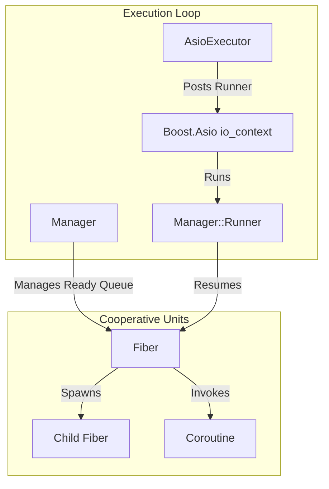
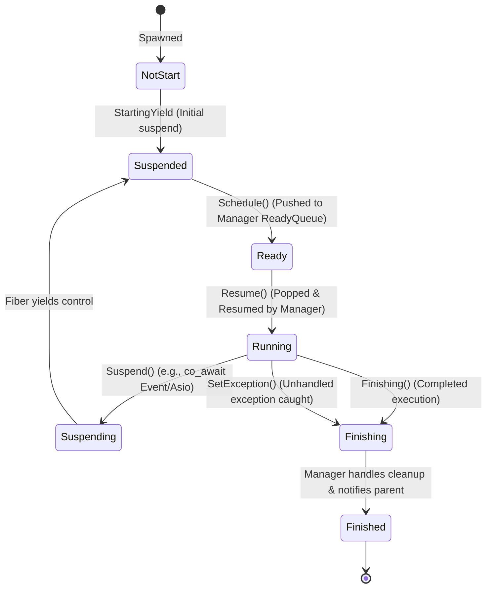
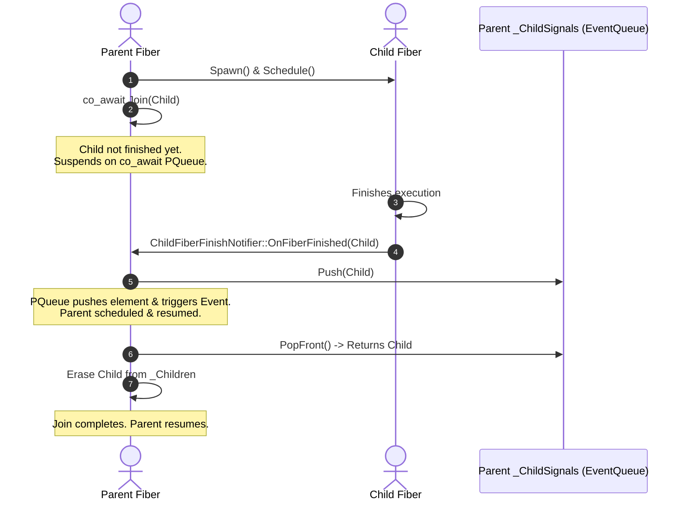

# OmniFiber: Architecture and Design Specifications

This document outlines the internal design, architecture, and implementation details of **OmniFiber**, a C++20 cooperative fiber library integrated with **Boost.Asio**.

---

## 1. Architectural Overview

OmniFiber addresses a key limitation of C++20 standard coroutines: **they are stackless language-level constructs and do not include a runtime scheduler**. To turn standard coroutines into full-featured, structured cooperative fibers, OmniFiber implements:

1. **A Custom Promise/Awaiter Lifecycle (`Coroutine<T>`)**: Handles state, return value, and resumes calling frames.
2. **A Fiber Representation (`Fiber`)**: Implements standard fiber properties like states, parent-child tracking, and interruption.
3. **An Execution Scheduler (`Manager` & `Executor`)**: Enqueues and dispatches "ready" fibers cooperative-multitasking style.
4. **Boost.Asio Integration (`AsioEvent` & `AsioUseFiber`)**: Adapts asynchronous callbacks into cooperatively suspending await points.



---

## 2. The Custom C++20 Coroutine State Machine (`Coroutine<T>`)

Standard C++20 coroutines require a return type acting as the "coroutine interface" along with a nested `promise_type`. OmniFiber defines `Coroutine<RetType>`, where:

- `PromiseBase`, `PromiseVoid`, and `PromiseNonVoid` act as promise objects representing the coroutine's internal control block:
  - `initial_suspend()` returns `std::suspend_never{}`, meaning the coroutine starts executing immediately upon call.
  - `final_suspend()` returns a custom `FinalAwaiter`.
  - When the coroutine hits its final suspension point (completion/return), `FinalAwaiter` resumes the continuation handle of the caller. This transfers execution back up the call stack.
- `Awaitable` acts as the `co_await` adapter. When a caller coroutine invokes `co_await callee`, the `Awaitable` registers the caller as the `_Continuation` waiter and yields control. Once the callee finishes, it resumes the caller.

> [!NOTE]
> The lifecycle of the underlying coroutine state is bound to the `Coroutine` object. The custom `FinalAwaiter` suspends at the very end (`final_suspend`), ensuring that `std::coroutine_handle::destroy()` is safely managed by the `Coroutine` destructor when the block scope terminates.

---

## 3. Fiber Lifecycle and State Machine

A `Fiber` is a scheduled unit of execution wrapped around an outer root `Coroutine<void>`. It transitions through several distinct states during its lifetime:



### State Definitions & Transition Mechanics

1. **`NotStart`**: The initial state when a `Fiber` is constructed. Inside the constructor, a wrapper helper `SpawnFiber` is invoked, which immediately triggers the coroutine's `initial_suspend()`.
2. **`Suspended`**: The fiber is yielding. Upon `initial_suspend()`, the fiber executes `StartingYield()`, capturing the initial coroutine handle, shifting to `Suspended`, and returning flow to the creator.
3. **`Ready`**: The fiber is placed in the `Manager`'s run queue. The transition from `Suspended` to `Ready` occurs when `Schedule()` is called.
4. **`Running`**: The scheduler is actively executing the fiber. The `Manager` calls `fiber->Resume()`, which invokes `coroutine_handle::resume()`.
5. **`Suspending`**: The fiber has hit a cooperative suspension point (e.g. `co_await event`). It invokes `Suspend()`, stores the caller continuation handle, and changes its state to `Suspending` before yielding back to the `Manager`'s loop.
6. **`Finishing`**: The fiber has finished its outer function or encountered an unhandled exception. It triggers `final_suspend()`, calling `Finishing()` or `SetException()`.
7. **`Finished`**: The fiber has completely unwound. The `Manager` marks it as `Finished` and notifies listeners.

---

## 4. Structured Parent-Child Concurrency and Joining

OmniFiber implements a structured parent-child relationship between fibers to prevent orphaned tasks and leaking resources:

- **Spawning**: When in a running fiber, calling `Spawn` constructs a child `Fiber`. The parent stores a `std::shared_ptr` to the child inside its `_Children` set, ensuring the child's lifetime is tied to the parent's hierarchy.
- **Finishing & Signaling**: Each fiber implements a `ChildFiberFinishNotifier`. When a child fiber terminates, it invokes the parent's `OnFiberFinished` callback, which pushes the child's pointer into the parent's `_ChildSignals` event queue.
- **Joining**: When a parent joins a child via `co_await Join(child)`, it enters a cooperative loop:
  1. If the child is already `Finished`, it erases the child from `_Children` and returns immediately.
  2. If the child is still running, the parent fiber suspends itself by calling `co_await _ChildSignals`.
  3. When signaled, the parent wakes up, pops the finished fibers from the queue, and checks if the targeted child is among them. Once joined, it removes the child from `_Children` and resumes execution.



---

## 5. Boost.Asio Integration and `AsioUseFiber`

The signature feature of OmniFiber is its integration with **Boost.Asio**, enabling standard asynchronous I/O operations to be awaited directly inside fibers.

### The `AsioExecutor`
A lightweight bridge that connects the `Manager` to the Boost.Asio event loop:
- `AsioExecutor` implements the virtual `Executor::Post(Manager&)` method.
- When `Post` is called, it posts the `Manager::Runner` functor to the `boost::asio::io_context` using `boost::asio::post`.
- This ensures that fiber scheduling tasks execute as standard callbacks in the Asio event loop.

### Custom Completion Token (`AsioUseFiber`)
Boost.Asio's extensible architecture uses **Completion Tokens** to customize the return type of asynchronous operations. OmniFiber hooks into this mechanism by specializing the `boost::asio::async_result` struct for the `AsioUseFiberType` token:

```cpp
namespace boost {
namespace asio {

template <typename... Results> struct async_result<Omni::Fiber::AsioUseFiberType, void(Results...)> {
  template <typename Initiation, typename... InitArgs>
  static Omni::Fiber::Coroutine<std::tuple<Results...>> initiate(Initiation&& init, Omni::Fiber::AsioUseFiberType,
                                                                 InitArgs&&... initArgs) {
    // 1. Create a cooperatively awaitable event to capture the results
    using EventType = Omni::Fiber::AsioEvent<Results...>;
    std::shared_ptr<EventType> event = std::make_shared<Omni::Fiber::AsioEvent<Results...>>();

    // 2. Initiate the standard Asio operation, binding a callback that completes the event
    init(boost::asio::bind_cancellation_slot(event->GetCancelSlot(),
                                             [event(std::weak_ptr<EventType>(event))](Results... results) {
                                               if (auto ev = event.lock()) {
                                                 ev->Finish(std::make_tuple<Results...>(std::move(results)...));
                                               }
                                             }),
         std::forward<InitArgs>(initArgs)...);

    // 3. Cooperatively co_await the event inside the fiber
    co_return co_await *event;
  }
};

} // namespace asio
} // namespace boost
```

### Flow of a Cooperative Async I/O Call:
1. The fiber calls `co_await socket.async_read_some(buffer, AsioUseFiber)`.
2. The specialized `async_result::initiate` is triggered. It instantiates an `AsioEvent` and binds the Asio completion callback to `AsioEvent::Finish()`.
3. It passes a cancellation slot from the `AsioEvent` to the Asio async operation (supporting seamless cancel-on-interrupt).
4. The fiber executes `co_await *event`. Since no results are ready, the event returns `false` on `await_ready()`, captures the current running fiber in `await_suspend()`, suspends it, and yields control back to the `Manager`.
5. The physical thread is not blocked; Boost.Asio continues running other ready fibers or network polling.
6. Once the I/O operation completes, Boost.Asio triggers the completion callback, which invokes `AsioEvent::Finish()`.
7. `Finish()` stores the retrieved results in `_Results` and schedules the suspended fiber back onto the `Manager`.
8. When the fiber runs again, `await_resume()` returns the unpacked results tuple (e.g. `std::tuple<boost::system::error_code, size_t>`).

---

## 6. Synchronization Primitives

OmniFiber provides cooperative synchronization tools to coordinate independent fibers without blocking system threads.

### `Event`
An `Event` acts as a cooperative binary semaphore or notification signal:
- It maintains a `std::list<std::weak_ptr<Fiber>> _PendingSet` containing fibers waiting for the event.
- When `co_await event` is called, it triggers `Event::Awaitable::await_suspend()`, which:
  - Appends the current active fiber (`Manager::GetCurrentFiber()`) to `_PendingSet`.
  - Suspends the fiber cooperatively.
- When a fiber calls `Set()`, the event sets `_IsSet = true`, walks the `_PendingSet`, schedules each waiting fiber back onto the `Manager`, and clears the pending list.

### `EventQueue<T>`
A producer-consumer queue constructed on top of `Event` and `std::queue<T>`:
- When `Push()` is called, it enqueues the element and triggers `_Event.Set()`, notifying any waiting consumer fiber.
- When `co_await queue` is called, the consumer awaits `_Event`. If the queue is empty, the consumer suspends cooperatively.
- When the consumer resumes, it calls `PopFront()`, which retrieves the element and resets the internal `_Event` if the queue has been depleted.

---

## 7. Interruption and Exception Propagation

Structured cooperative programming requires robust mechanisms for cancellation and exception safety:

### Interruption Lifecycle
1. When a control thread or a sibling fiber calls `fiber->Interrupt()`, it sets the fiber's `_Interrupted` flag to `true`.
2. When the interrupted fiber reaches its next cooperative await/resume point (e.g., inside `FiberAwaitable::await_resume()`), it checks if `_Interrupted` is set.
3. If set, it immediately throws a `Fiber::FiberInterrupted` exception.
4. The exception unwinds the coroutine call stack, destroying local variables, closing resource handles, and triggering RAII cleanups.

### Unhandled Exception Handling
- If an exception propagates completely out of the root coroutine's entry function, it is caught by `Promise::unhandled_exception()`.
- `unhandled_exception()` captures the active exception pointer using `std::current_exception()` and calls `Fiber::SetException()`.
- `SetException()` stores the exception pointer in `_Exception` and transitions the fiber to `Finishing` state, ensuring the manager can clean up its resources and log the error correctly.
